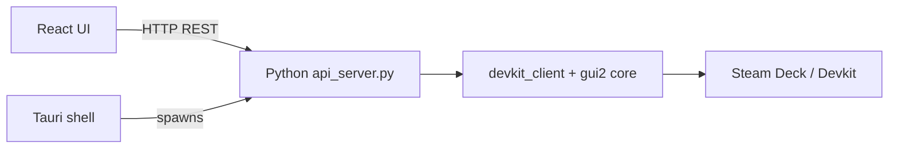

# Steam Devkit (Tauri)

A native **macOS** desktop port of the [SteamOS Devkit Client for macOS](https://github.com/3Samourai/SteamOS-Devkit-Client-MacOS), built with [Tauri](https://tauri.app/) and a modern web UI.

The original project is an unofficial port of Valve’s [SteamOS Devkit](https://gitlab.steamos.cloud/devkit/steamos-devkit) tooling. This repository keeps the same Python devkit logic (SSH, mDNS discovery, uploads, etc.) and replaces the ImGui/SDL desktop shell with Tauri + React.

## Architecture



- **Frontend**: React + TypeScript (Vite)
- **Shell**: Tauri 2 (Rust) — starts and stops the Python API process
- **Backend**: `python-client/` — vendored client from the macOS port, headless HTTP API on `http://127.0.0.1:32100`

## Prerequisites

- **macOS** 14+ (same target as the upstream port)
- **Node.js** 18+ and **npm**
- **Rust** toolchain (`rustup`)
- **Python** 3.9+ (3.12 recommended; project venv is created locally)

## Setup

```bash
# Install frontend + Tauri CLI deps
npm install

# Create Python venv and install devkit dependencies
npm run setup:python
```

## Development

```bash
npm run tauri dev
```

This starts the Vite dev server, launches Tauri, and spawns the Python API automatically.

## Production build

```bash
npm run tauri build
```

The `.app` bundle is produced under `src-tauri/target/release/bundle/`. For production you still need the `python-client` tree and a working Python environment next to the app (or extend bundling to ship the venv — not automated yet).

## Features (v0.1)

| Feature | Status |
|--------|--------|
| mDNS devkit discovery | Yes |
| Connect by IP | Yes |
| Register / pair devkit | Yes |
| Select devkit & view status | Yes |
| Remote shell, screenshot, sync logs | Yes |
| Restart session, CEF console | Yes |
| List installed games | Yes |
| Title upload / RenderDoc / GPU trace UI | Not yet (API can be extended) |

Settings are stored in the same location as the original GUI client (`~/.devkit-client-gui/settings.pickle`) so preferences can carry over.

## Python API (local)

| Method | Path | Description |
|--------|------|-------------|
| GET | `/api/health` | Health check |
| GET | `/api/devkits` | List all devkits |
| POST | `/api/devkits/connect` | Add devkit by IP |
| POST | `/api/devkits/{name}/register` | Pair with device |
| POST | `/api/selected` | Select active devkit |
| GET | `/api/selected` | Get selection |
| POST | `/api/devkits/{name}/refresh-status` | Refresh SteamOS status |
| POST | `/api/devkits/{name}/remote-shell` | Open SSH shell |
| … | … | See `python-client/api_server.py` |

## License

The vendored `python-client` code retains the MIT license from Valve/Collabora and the macOS port. See `python-client/LICENSE`.
